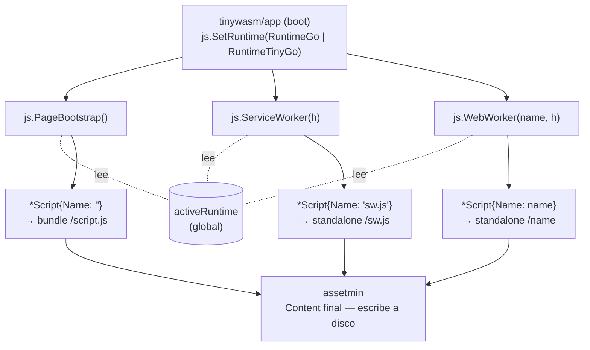
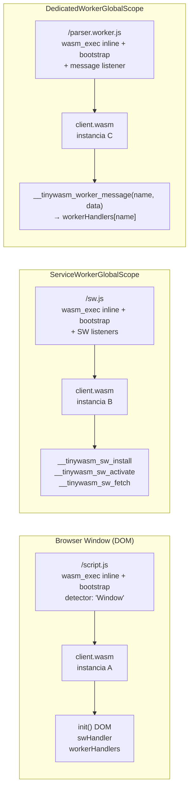
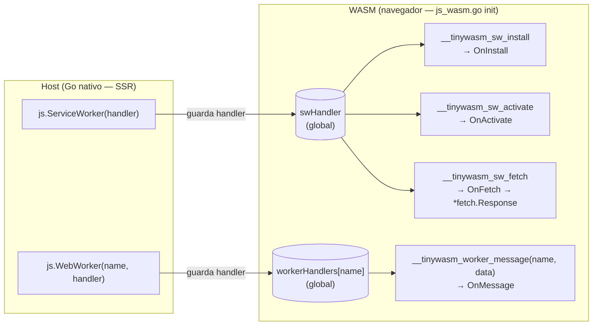

# Architecture — tinywasm/js

## Flujo general

## Contextos de ejecución WASM

El mismo binario `client.wasm` se carga en tres contextos distintos del navegador. Cada contexto es un scope JS aislado — no pueden compartir la instancia WASM entre sí.

El shim detecta el contexto vía `self.constructor.name` para evitar ejecutar código DOM en SW/Worker.

## Separación de responsabilidades

| Paquete | Responsabilidad |
|---|---|
| `tinywasm/js` | Composición JS (shims, embeds, constructores tipados). **Única fuente de wasm_exec.js** |
| `tinywasm/client` | Compilación WASM (Go/TinyGo), serving `/client.wasm`. **Sin JS** |
| `tinywasm/app` | Orquestación: llama `js.SetRuntime`, registra `js.PageBootstrap()` con assetmin |
| `assetmin` | Bundling: recibe `[]*js.Script` con `Content` final, escribe a disco |

## Registro de handlers (lado WASM)

## Decisiones clave

- **`activeRuntime` es estado global write-once**: `app` lo escribe una vez al boot antes de que los módulos llamen `RenderJS()`. El extractor SSR de assetmin corre en el mismo proceso → ve el global. Sin parámetros para el usuario.
- **`Content` es string final**: `assetmin` lo escribe tal cual. Sin interfaces extra, sin resolución diferida. Idéntico al modelo de `tinywasm/css`.
- **Sin `wasm_exec.js` en disco**: el archivo se inlinea en cada shim. No hay ruta `/wasm_exec.js` pública.
- **`client/assets/` eliminado**: `js/assets/` es la única fuente de verdad. Un solo lugar a actualizar cuando Go o TinyGo publican nuevas versiones del runtime.
